<picture>
  <source media="(prefers-color-scheme: dark)" srcset="docs/images/plate-dark.png">
  <source media="(prefers-color-scheme: light)" srcset="docs/images/plate-light.png">
  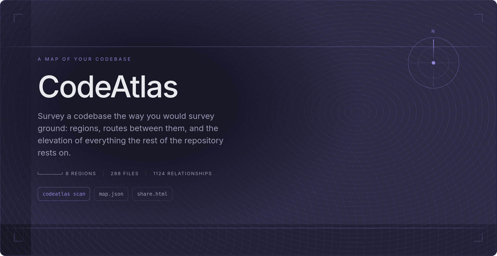
</picture>

# CodeAtlas

One command turns a repository into a knowledge graph — files, functions,
classes, and the import/export/call edges between them — rendered as an
interactive map you can search, walk through, and ask questions of. It runs
offline by default: scanning, serving, diffing, and sharing never open a
non-loopback socket, and a sealed build exists in which egress is not a
forbidden action but a compile error.

The map itself needs no model and no key: `codeatlas scan .` writes the
whole picture to `.codeatlas/knowledge-graph.json`; enrichment and questions
are opt-in flags on top. Run it and look — the counts belong to whatever the
repository is on the day you run it, so none are written down here.

## Quick start

```sh
# one-time: the dashboard is compiled into the binary, so its deps must exist
cd dashboard && npm ci && cd ..

cargo build --release

./target/release/codeatlas scan .     # writes .codeatlas/knowledge-graph.json
./target/release/codeatlas serve .    # opens the map on http://127.0.0.1:4173/
```

Everything CodeAtlas writes lands in `.codeatlas/` under the scanned root,
and a scan puts a `.gitignore` there so you do not have to: the regenerated
map is ignored, the annotation store is published. That one exception is
deliberate — [Enrichment](#enrichment-optional) explains it, along with the
one `.gitignore` interaction worth knowing.

### Optional: shell aliases

The binary targets whatever repository you run it in, so a handful of
aliases make it a global tool — adjust the first path to your clone. The
model-touching pair carry `--provider cli:claude` on purpose: baking the
flag in makes the bare-flag trap described in
[Enrichment](#enrichment-optional) impossible to hit from muscle memory.

```sh
alias codeatlas='$HOME/Code/CodeAtlas/target/release/codeatlas'
alias cas='codeatlas scan .'                                        # map this repo
alias cav='codeatlas serve .'                                       # view it (127.0.0.1:4173)
alias caq='codeatlas serve . --ask --provider cli:claude'           # view it + questions
alias cae='codeatlas scan . --enrich --provider cli:claude'         # buy prose for what changed
alias caed='codeatlas scan . --enrich --dry-run --provider cli:claude'  # say the price, spend nothing
alias cakill='pkill -x codeatlas'                                   # stop a running server
```

## How it works

<picture>
  <source media="(prefers-color-scheme: dark)" srcset="docs/images/pipeline-dark.png">
  <source media="(prefers-color-scheme: light)" srcset="docs/images/pipeline-light.png">
  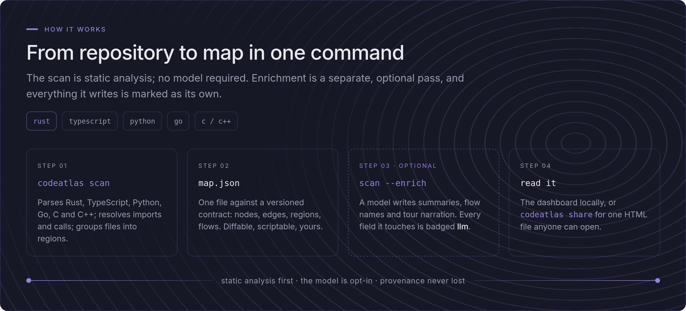
</picture>

## What it looks like

Live captures and designed cards, all drawn from CodeAtlas's own map — the
pictures follow your GitHub theme, and the counts inside them belong to the
day the map was scanned.

### How to read the map

<picture>
  <source media="(prefers-color-scheme: dark)" srcset="docs/images/legend-dark.png">
  <source media="(prefers-color-scheme: light)" srcset="docs/images/legend-light.png">
  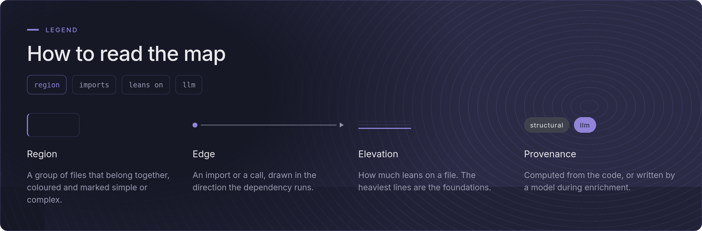
</picture>

### The whole repository as a handful of regions

<picture>
  <source media="(prefers-color-scheme: dark)" srcset="docs/images/regions-dark.png">
  <source media="(prefers-color-scheme: light)" srcset="docs/images/regions-light.png">
  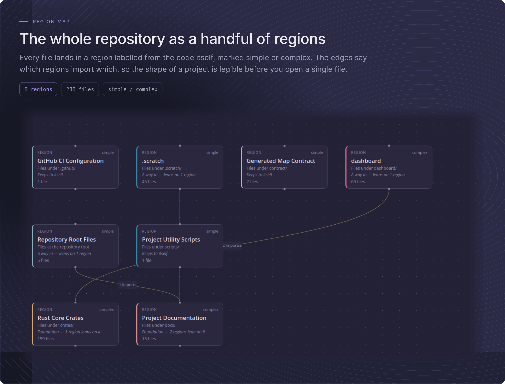
</picture>

### The same repository, structurally and by behaviour

<picture>
  <source media="(prefers-color-scheme: dark)" srcset="docs/images/twoviews-dark.png">
  <source media="(prefers-color-scheme: light)" srcset="docs/images/twoviews-light.png">
  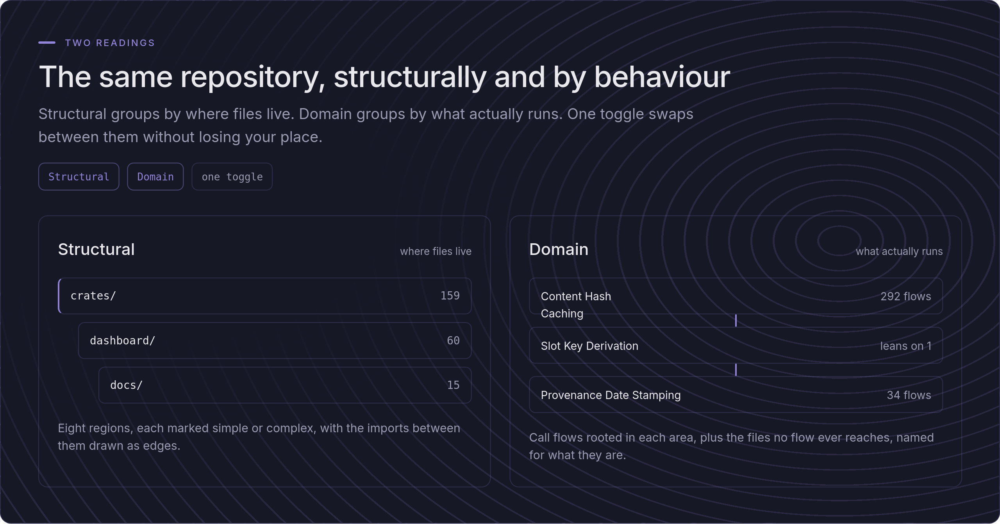
</picture>

### Follow the call flows, not the folder tree

<picture>
  <source media="(prefers-color-scheme: dark)" srcset="docs/images/flows-dark.png">
  <source media="(prefers-color-scheme: light)" srcset="docs/images/flows-light.png">
  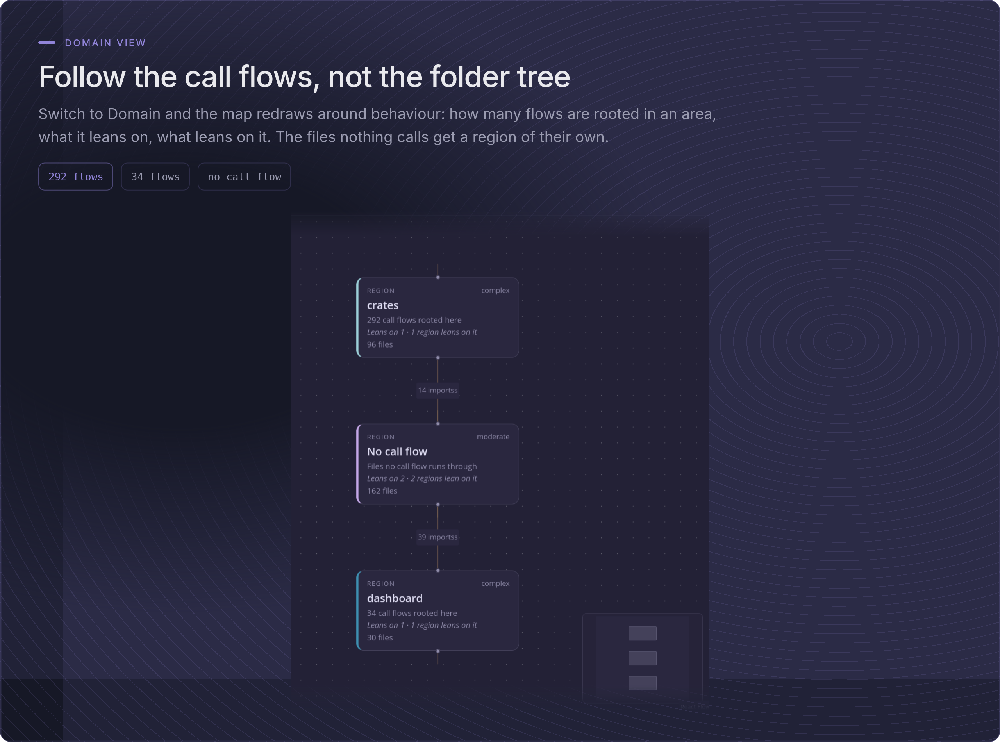
</picture>

### One file, everything it touches

<picture>
  <source media="(prefers-color-scheme: dark)" srcset="docs/images/focus-dark.png">
  <source media="(prefers-color-scheme: light)" srcset="docs/images/focus-light.png">
  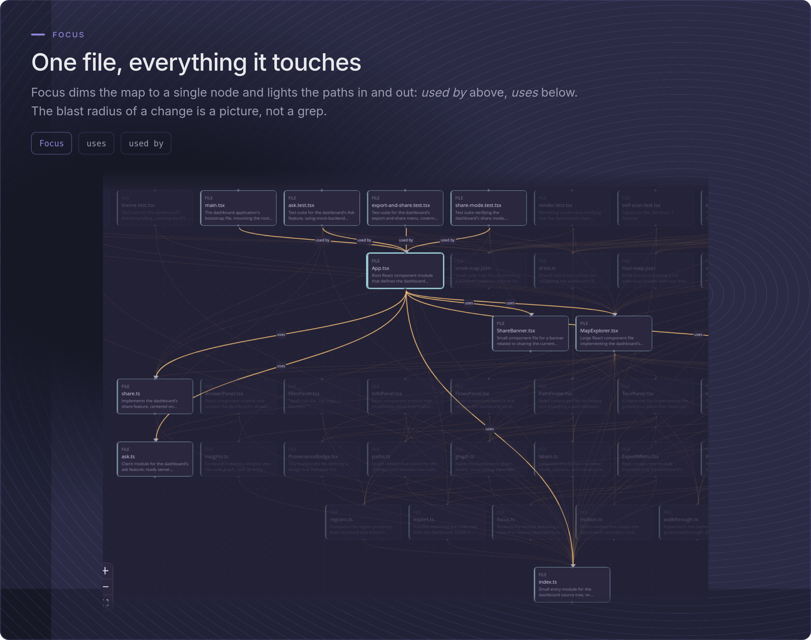
</picture>

### Every symbol, file and summary, one keystroke away

<picture>
  <source media="(prefers-color-scheme: dark)" srcset="docs/images/search-dark.png">
  <source media="(prefers-color-scheme: light)" srcset="docs/images/search-light.png">
  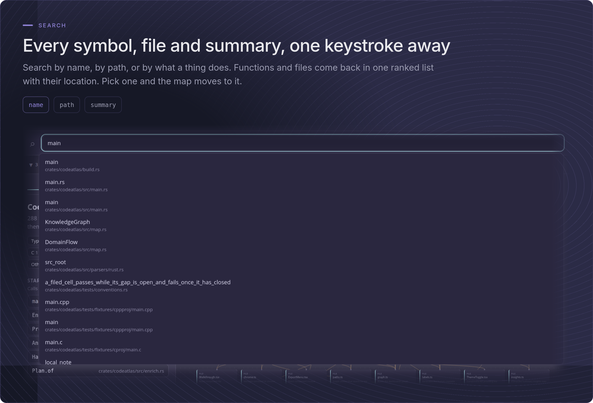
</picture>

### Ask the map a question in plain English

<picture>
  <source media="(prefers-color-scheme: dark)" srcset="docs/images/ask-dark.png">
  <source media="(prefers-color-scheme: light)" srcset="docs/images/ask-light.png">
  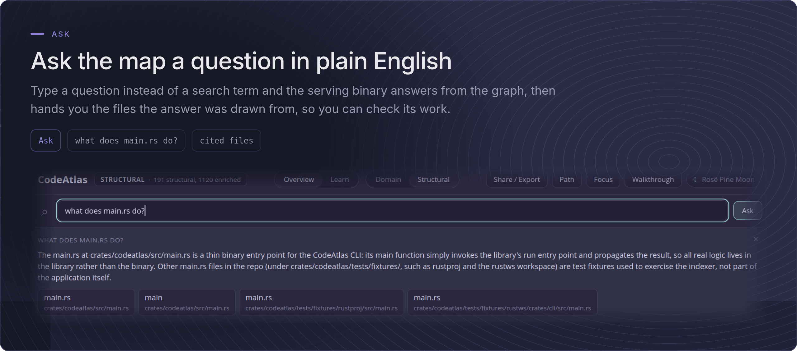
</picture>

<!-- HELD BANNERS — two pairs exist in the design file but are not published:
  walkthrough-{dark,light}.png says "Thirteen steps" (and a "13 steps" chip);
  the shipped walkthrough has fourteen — re-export without the number.
  hero-{dark,light}.png says "in nine themes"; the dashboard ships two.
  After re-export, drop the files into docs/images/ and give each its
  <picture> block here (walkthrough) and wherever the hero should live. -->

### Where to start, and what everything leans on

<picture>
  <source media="(prefers-color-scheme: dark)" srcset="docs/images/panel-dark.png">
  <source media="(prefers-color-scheme: light)" srcset="docs/images/panel-light.png">
  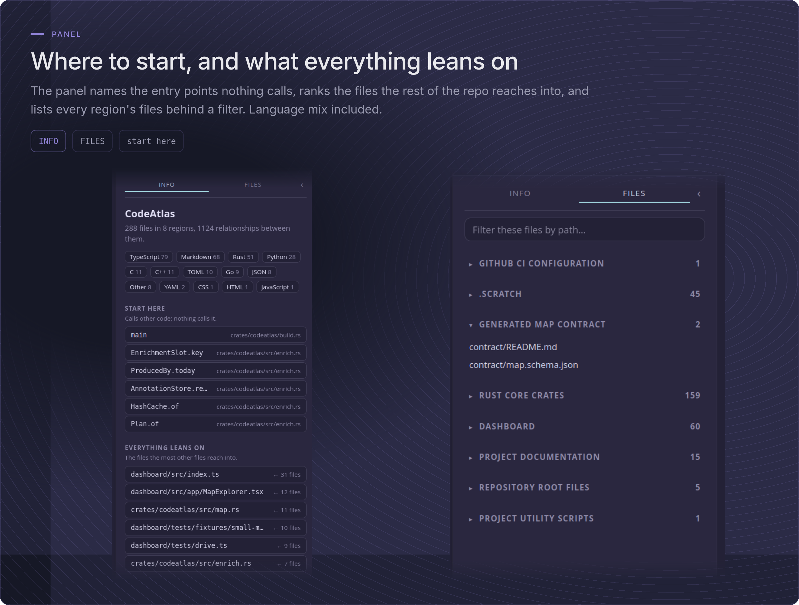
</picture>

### You always know which parts a model wrote

<picture>
  <source media="(prefers-color-scheme: dark)" srcset="docs/images/provenance-dark.png">
  <source media="(prefers-color-scheme: light)" srcset="docs/images/provenance-light.png">
  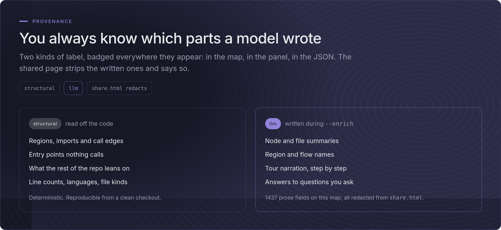
</picture>

### Take the map with you

<picture>
  <source media="(prefers-color-scheme: dark)" srcset="docs/images/share-dark.png">
  <source media="(prefers-color-scheme: light)" srcset="docs/images/share-light.png">
  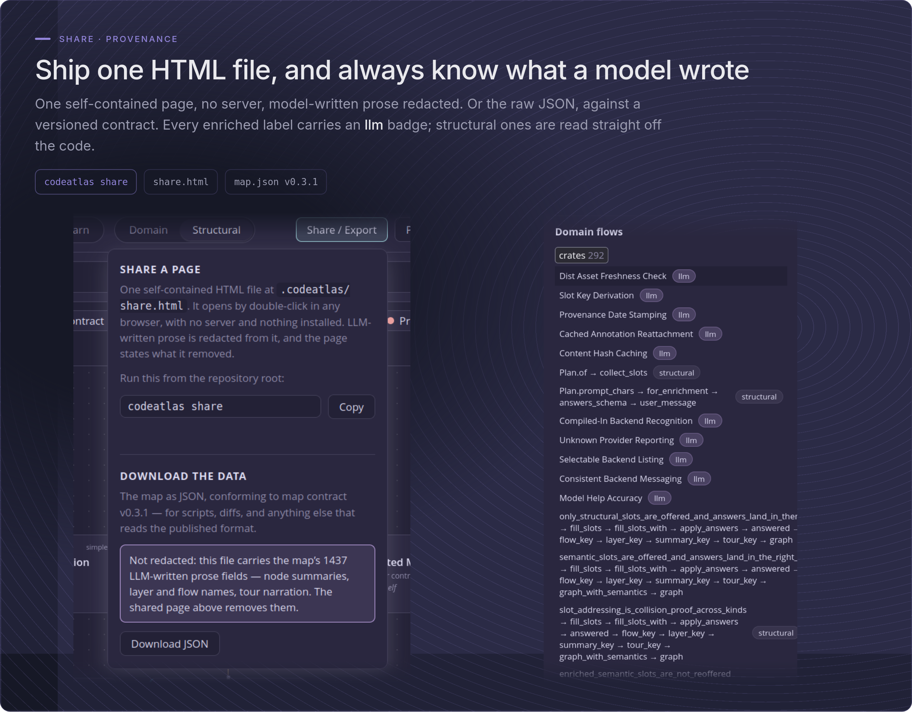
</picture>

## Commands

| Command | What it does |
| --- | --- |
| `scan [PATH]` | Walk the repo, parse it, write the map to `.codeatlas/knowledge-graph.json`. `--enrich` additionally fills prose slots through an LLM (see below); `--provider` chooses which one. |
| `serve [PATH]` | Serve the dashboard and the local map from memory on `127.0.0.1`. `--port` chooses the port; there is deliberately no `--host`. `--ask` additionally answers questions about the map at `POST /api/ask`, through the same providers `--enrich` uses. |
| `diff [PATH]` | Project a git diff onto the map: changed nodes plus their one-hop blast radius, written to `.codeatlas/diff-overlay.json`. Pure git and graph traversal — no LLM, no network. |
| `share [PATH]` | Export one self-contained, redacted HTML file that opens by double-click, with no server and no external requests. |
| `schema` | Print the JSON Schema of the map contract. |

The dashboard picks up the diff overlay automatically when one exists, offering
a toggle that distinguishes changed nodes from the ones they affect.

## Languages

| Language | Extensions |
| --- | --- |
| TypeScript | `.ts`, `.tsx` |
| JavaScript | `.js`, `.jsx`, `.mjs`, `.cjs` |
| Rust | `.rs` |
| Python | `.py` |
| Go | `.go` |
| C | `.c`, `.h` |
| C++ | `.cpp`, `.cc`, `.cxx`, `.hpp`, `.hh`, `.hxx` |
| Markdown | `.md`, `.markdown` — relative links become edges; no symbols |

Parsing uses tree-sitter grammars compiled into the binary; nothing is
downloaded at runtime. Files in unsupported languages still appear as nodes,
so the map stays complete. Every parser resolves imports and calls
conservatively: an edge that cannot be resolved to a node inside the map is
dropped rather than emitted dangling.

## The map contract

The emitted map conforms to a published, versioned contract
(`contract/map.schema.json`, currently **0.3.1**) generated from the Rust
types in `crates/codeatlas/src/map.rs` — the single source of truth. The
dashboard's TypeScript types are generated from the same schema, and CI fails
on any drift between the types and their generated artifacts. Consumers other
than the bundled dashboard can rely on the schema; `contract/README.md` states
the compatibility policy.

Node descriptions carry a `provenance` field of `structural` or `llm`, so a
reader can always tell a mechanically derived fact from a generated one.

## Enrichment (optional)

`scan --enrich` fills the map's prose slots — node summaries, layer names,
domain-flow names, tour narration — through an enrichment provider. It is
entirely opt-in, and the mechanical values are always present underneath:
enrichment relabels reality, it never creates it. If the provider fails, is
unreachable, or is never configured, you still get a complete, schema-valid
structural map.

Annotations are cached in `.codeatlas/annotations.json` keyed by node identity
and a content hash, so a later scan re-attaches unchanged answers for free and
only re-purchases the parts of the map that actually changed.

**That store is meant to be committed.** Enrichment is a per-developer
purchase, so one person enriches, commits, and pushes; everyone else clones
and runs a plain `codeatlas scan` — no credential, no network, no flags — and
gets the map with all its prose. The store records which provider, which
model, and what date produced it, so a reviewer reading the diff can see where
the prose came from. If you would rather not publish it, delete the
`!annotations.json` line from `.codeatlas/.gitignore`; scans write that file
only when it is missing and never overwrite it, so your edit stands.

One interaction to check: if your repository already ignores `.codeatlas/`
outright, narrow that line to `**/.codeatlas/*` — CodeAtlas's own rule. Git
never lets a nested file re-include anything under an excluded *directory*,
so an outright exclusion keeps the store unpublished no matter what the
nested `.gitignore` says; ignoring the contents lets it do its job. The
`**/` keeps the rule alive for scans run from a subdirectory.

There are two providers, chosen with `--provider` or
`CODEATLAS_ENRICH_PROVIDER`:

- **`claude`** — the Claude API. Credentials resolve like the official SDKs:
  `ANTHROPIC_API_KEY` first, then an `ant auth login` profile. The default
  model is `claude-opus-5` (`--model` overrides). Billed per token, to the
  key's account.
- **`cli:claude`** — the Claude CLI you are already logged into, spawned as a
  one-shot completion with no tools and no MCP servers. CodeAtlas never
  handles a credential, which is the point: an API key is out of reach in
  plenty of organisations. Draws on the CLI's own subscription allowance;
  `ANTHROPIC_API_KEY` is deliberately stripped from the child's environment.

**Name the provider.** On a default build, plain `scan --enrich` falls
through to `claude` — the API-key path — because that is the build's default
backend. If you mean your subscription, say so; the absence of a flag is not
a choice:

```sh
codeatlas scan . --enrich --provider cli:claude
```

### Running it

Ask what it would cost before spending anything:

```sh
codeatlas scan . --enrich --dry-run --provider cli:claude
```

Every enrichment run states its price up front and reports progress as it
goes — one line per batch, the same on a terminal and in a log. The shape
(the numbers are one repository on one day, not a promise):

```text
mapped 287 files
enriching: 1651 slots in 67 calls: roughly 146k–194k tokens of prompt,
plus perhaps 41k–74k more coming back
  batch 1/67 — 25 slots filled
  batch 2/67 — 50 slots filled
  …
enriched 1651 slots
```

The token figure is a range because there is no local tokenizer and a single
number would be a guess wearing a lab coat; the call count is exact, computed
by the same code that then makes the calls. No price is ever printed — rates
move, and on `cli:claude` there is no monetary price at all.

Batches run four at a time, and **every answered batch is saved as it
lands**. Interrupting a run — Ctrl-C, a rate limit, a dropped connection —
keeps everything already bought: the failure message says how much survived,
and the next `--enrich` re-purchases only what is missing. A re-run after an
edit costs only the edited files' slots, which the estimate line will show
you before it spends:

```text
enriching: 9 slots in 1 calls: roughly 782–1k tokens of prompt, …
```

Prompts are bounded on both providers — the model receives the slots being
filled and summarized topology, never the serialized graph and never file
contents.

### Asking the map questions

`serve --ask` reaches the same providers for a different purpose: a question
about the map, answered from a bounded slice of the map alone, citing the
node IDs the answer came from. Same rule as `--enrich` — name the provider,
or the default build quietly picks the API key:

```sh
codeatlas serve . --port 4173 --ask --provider cli:claude
```

The dashboard notices by itself (`GET /api/capabilities`): the search field
grows an **Ask** button and its placeholder says a question is welcome.
Without `--ask` the feature is hidden entirely — a server that cannot answer
must not advertise — and the terminal tells you the flag exists instead.
Every question is one provider call; an enriched map answers far better than
a structural one, because the answer is drawn from the map's own prose.

## Security

> CodeAtlas has exactly two ways to reach a model — an HTTPS POST to
> `api.anthropic.com`, and spawning the already-authenticated `claude` CLI.
> Each sits behind its own Cargo feature; each is reachable only from
> `scan --enrich` and `serve --ask`. The sealed build has neither.

For the HTTPS route the destination is a hardcoded constant, and redirects
and environment proxies are disabled at the transport level, so the transport
cannot be steered elsewhere. Three build configurations are therefore
auditable: both features, neither, and the CLI without the HTTP client.
Building with `--no-default-features` produces the sealed binary, in which
every command still works and both `--enrich` and `--ask` refuse with a clear
message.

These are tested claims, not documentation. **[docs/SECURITY.md](docs/SECURITY.md)**
is the audit entry point: it maps each guarantee to the code and the committed
test that enforces it, states what a model receives on each path, names the CI
jobs that run them, and records the honest limitations.

## Development

```sh
cargo test --workspace                        # default build
cargo test --workspace --no-default-features  # sealed build
cargo test --workspace --no-default-features --features agent-cli  # CLI, no HTTP client
cd dashboard && npm test -- --run             # dashboard
```

CI runs all three Rust configurations, the dashboard suite, and a
contract-drift check that regenerates the schema and the TypeScript types and
fails on any diff. If you change a contract struct, regenerate both:

```sh
cargo run -p codeatlas -- schema > contract/map.schema.json
cd dashboard && npm run generate
```

Requires a Rust toolchain (edition 2024) and Node 24. Tests run offline; the
egress suite uses unprivileged Linux network namespaces and skips with an
explicit message where those are unavailable.

## Design record

The decisions behind this design, with their trade-offs, are recorded as ADRs
in [`docs/adr/`](docs/adr/) — CLI-first rather than prompt orchestration, a
Rust core with a TypeScript dashboard, Rust types generating the public
contract, enrichment behind a provider trait, content-hash carry-over, zero
egress enforced by a compile-time feature gate, a committed annotation store,
enrichment through an authenticated CLI, and questions answered by the
serving binary. The V1 scope lives in [`docs/specs/`](docs/specs/).

## Status

V1 shipped on 2026-08-12. Every story in the V1 spec passes, and the record —
six verification walks plus a browser walk, story by story — lives in the
spec's own Verification section
([`docs/specs/2026-08-09-codeatlas-v1.md`](docs/specs/2026-08-09-codeatlas-v1.md)).
The agenda for what comes next is
[`docs/intake/2026-08-12-codeatlas-v1-next.md`](docs/intake/2026-08-12-codeatlas-v1-next.md);
its headline is the dashboard at scale — layout currently places nodes on a
fixed grid within each layer, which reads well for small repositories and
becomes crowded for large ones.

## Thanks

CodeAtlas is openly and strongly inspired by
[Understand Anything](https://github.com/Egonex-AI/Understand-Anything) by
Yuxiang Lin, and its execution was shaped throughout by studying that
project's. If you want the original, larger take on making a codebase
explain itself, start there.
