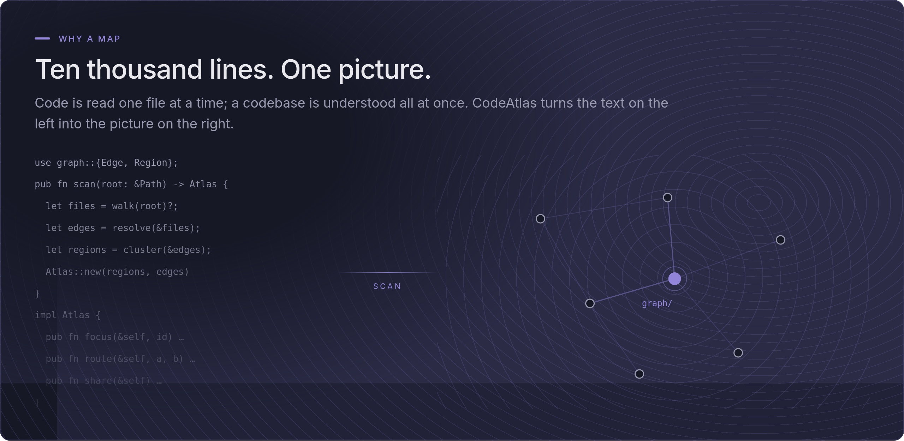
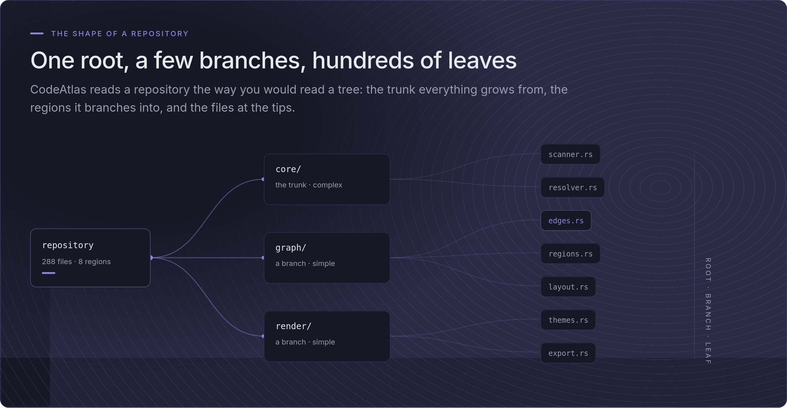
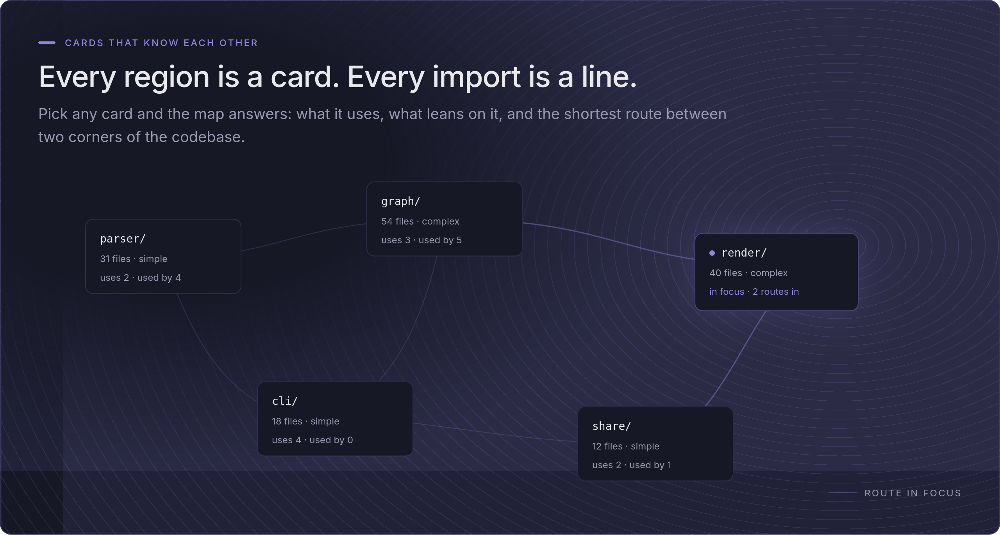
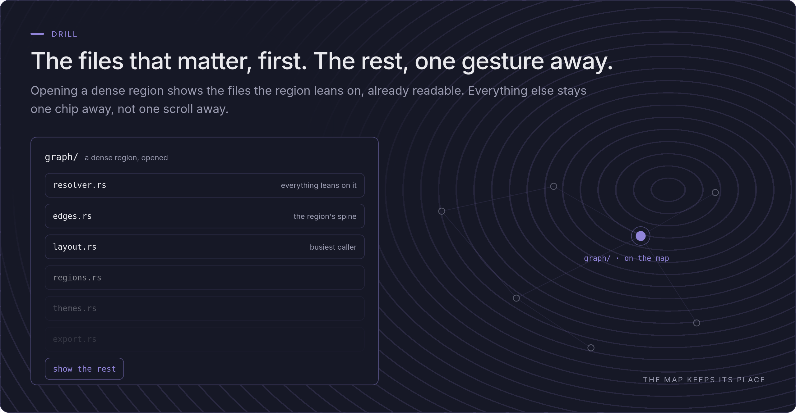
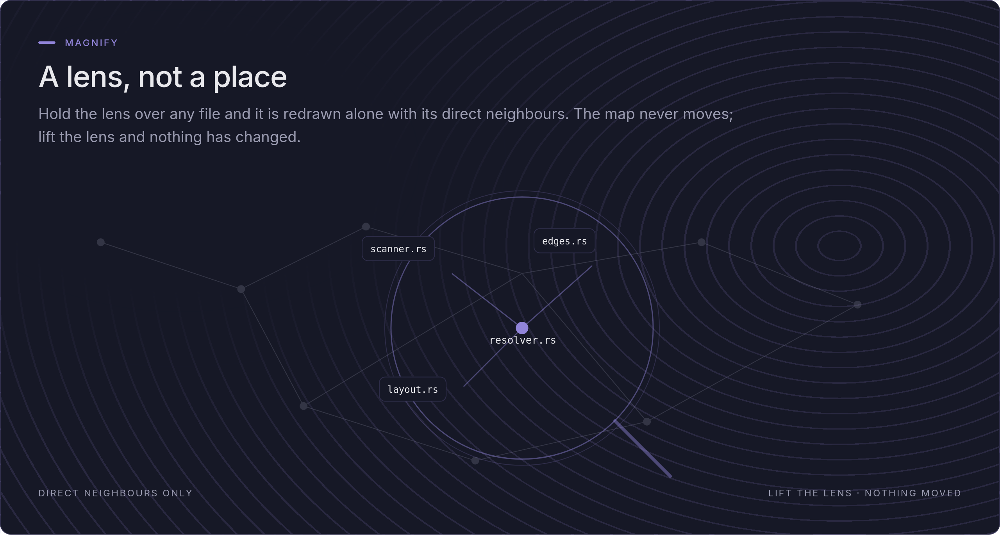
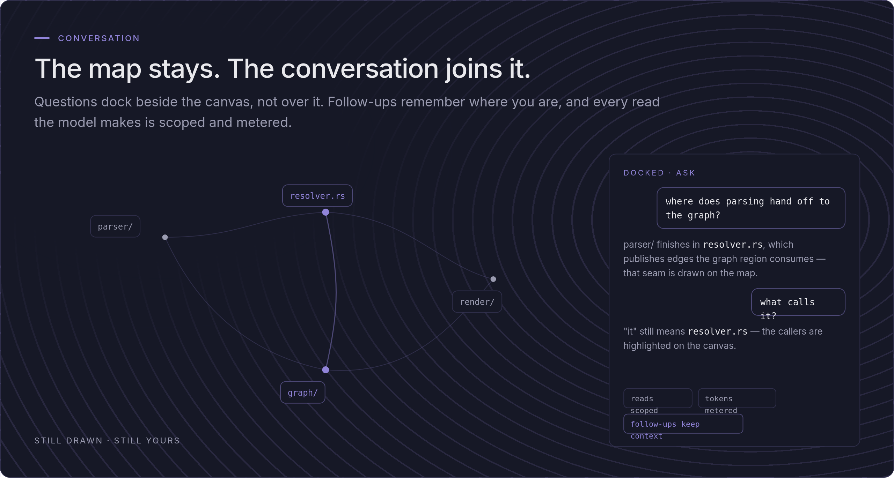

<!-- Head slot reserved for the screen recording. -->

<p align="center">
  
</p>

<h1 align="center">CodeAtlas</h1>

<p align="center">
  <strong>Review the code without reading every line.</strong><br>
  One command turns a repository into an interactive map: files, functions,
  classes, and the routes between them. You can search, walk, and ask questions.
</p>

<picture>
  <source media="(prefers-color-scheme: dark)" srcset="docs/images/plate-dark.png">
  <source media="(prefers-color-scheme: light)" srcset="docs/images/plate-light.png">
  
</picture>

<p align="center">
  <a href="https://github.com/Memnoc/CodeAtlas/releases"></a>
  <a href="LICENSE"></a>
  <a href="#install"></a>
</p>

<p align="center">
  <a href="#install"><strong>Install</strong></a> ·
  <a href="#how-it-works">Overview</a> ·
  <a href="#commands">Commands</a> ·
  <a href="#enrichment-optional">Enrichment</a> ·
  <a href="#security">Security</a> ·
  <a href="https://github.com/Memnoc/CodeAtlas/releases">Releases</a>
</p>

<p align="center">
  Maps <strong>TypeScript · JavaScript · Rust · Python · Go · C · C++ · Markdown</strong><br>
  Offline by default: loopback only, no key, no account needed.
</p>

In the era of AI we write more code than anyone can read, and I am a strong
advocate of knowing what is going on in the software you release into the
world. CodeAtlas is the tool I built for that: review the code, without
having to read every single line of it. It draws an unfamiliar codebase all
at once — and works just as well on the repo you know by heart, when you
only want one function or one slice of domain logic. The map itself needs no
model and no key; enrichment and questions are opt-in flags on top. The
counts on the map belong to whatever the repository is on the day you run
it, so none are written down here.

## Install

One downloaded file is the whole install, including the dashboard. `curl` is the default path on every platform,
and on macOS it is also the smoothest one: what the terminal fetches never
receives the quarantine mark, so Gatekeeper never gets in the way.

```sh
# macOS (Apple silicon)
curl -fLO https://github.com/Memnoc/CodeAtlas/releases/latest/download/codeatlas-aarch64-apple-darwin   # -f: fail loudly, never save an error page
chmod +x codeatlas-aarch64-apple-darwin && mv codeatlas-aarch64-apple-darwin codeatlas
./codeatlas

# Linux (x86_64)
curl -fLO https://github.com/Memnoc/CodeAtlas/releases/latest/download/codeatlas-x86_64-unknown-linux-musl
chmod +x codeatlas-x86_64-unknown-linux-musl && mv codeatlas-x86_64-unknown-linux-musl codeatlas
./codeatlas
```

<details>
<summary><strong>Mac and Linux</strong> — other targets, tag-pinned names, verification</summary>

An Intel Mac or an Arm Linux box swaps the target: `x86_64-apple-darwin`,
`aarch64-unknown-linux-musl` (the Linux binaries are static musl). The
`latest` URLs always fetch the newest release; every binary also exists
under a tag-pinned name, with a `-sealed` variant beside each, and the
[release notes](https://github.com/Memnoc/CodeAtlas/releases) carry the
SHA-256 checksums file and GitHub build-provenance attestation to verify
what you downloaded.

</details>

<details>
<summary>Run it <strong>bare</strong> — the terminal menu, key by key</summary>

`./codeatlas` will spawn a small terminal menu that guides you through
options: `Enter` opens a folder exactly like a file manager, `h` climbs,
`/` types a path,
`Enter` on the pinned `.` row maps the directory you are in — one confirm
screen states plainly whether open code is on (`o` toggles it), then it
scans, serves, and opens the map at `http://127.0.0.1:4173/` itself. The
menu remembers nothing: no history, no file written anywhere but the
repository you choose, and only ever appears when you run the binary by
hand at a terminal; in scripts and pipes a bare invocation prints usage,
exactly as a CLI should.

</details>

The commands to remember are:

```sh
./codeatlas scan .     # writes .codeatlas/knowledge-graph.json
./codeatlas serve .    # serves the map on http://127.0.0.1:4173/
```

Everything CodeAtlas writes lands in `.codeatlas/` under the scanned root,
and a scan puts a `.gitignore` there so you do not have to: the regenerated
map is ignored, the annotation store is published and that one exception is
deliberate, and it's explained in [Enrichment](#enrichment-optional).

> **macOS, browser downloads only:** these binaries are not Apple-signed or
> notarized, so macOS quarantines what a _browser_ saves and Gatekeeper
> refuses to run it. In other words, safety first: verify the
> download — the checksums file and the provenance attestation,
> exactly as the release notes show — and only then clear the mark with
> `xattr -d com.apple.quarantine <the file>`. (System
> Settings → Privacy & Security → "Allow Anyway" reaches the same end
> through more clicks.) The `curl` path above skips all of this, so keep that in mind.

<details>
<summary><strong>Build from source</strong> — Rust (edition 2024) and Node 24</summary>

```sh
# one-time: the dashboard is compiled into the binary, so its deps must exist
cd dashboard && npm ci && cd ..

cargo build --release

./target/release/codeatlas scan .     # writes .codeatlas/knowledge-graph.json
./target/release/codeatlas serve .    # serves the map on http://127.0.0.1:4173/
```

</details>

<details>
<summary><strong>Optional: shell aliases</strong></summary>

Point the first path at wherever your binary lives, whether that is the downloaded file or
your clone's build. The model-touching pair carry `--provider cli:claude` on
purpose: baking the flag in makes the bare-flag trap described in
[Enrichment](#enrichment-optional) impossible to hit from muscle memory.

```sh
alias codeatlas='$HOME/Code/CodeAtlas/target/release/codeatlas'
alias cas='codeatlas scan .'                                        # map this repo
alias cav='codeatlas serve .'                                       # view it (127.0.0.1:4173)
alias caq='codeatlas serve . --ask --provider cli:claude'           # view it + questions
alias cae='codeatlas scan . --enrich --provider cli:claude'         # buy prose for what changed
alias caed='codeatlas scan . --enrich --dry-run --provider cli:claude'  # say the price, spend nothing
alias cakill='pkill -x codeatlas'                                   # stop a running server
```

</details>

## How it works

<picture>
  <source media="(prefers-color-scheme: dark)" srcset="docs/images/viz-dark.png">
  <source media="(prefers-color-scheme: light)" srcset="docs/images/viz-light.png">
  
</picture>

<picture>
  <source media="(prefers-color-scheme: dark)" srcset="docs/images/pipeline-dark.png">
  <source media="(prefers-color-scheme: light)" srcset="docs/images/pipeline-light.png">
  
</picture>

Parsing uses tree-sitter grammars compiled into the binary; nothing is
downloaded at runtime. Files in unsupported languages still appear as nodes,
so the map stays complete, and every parser resolves imports and calls
conservatively. An edge that cannot be resolved to a node inside the map is
dropped rather than emitted dangling.

The emitted map conforms to a published, versioned contract
(`contract/map.schema.json`, currently **0.5.0**) generated from the Rust
types, which works as the single source of truth. The dashboard's TypeScript types are
generated from the same schema, CI is meant to fail on any drift, and consumers other
than the bundled dashboard can rely on it; `contract/README.md` states the
compatibility policy. Node descriptions carry a `provenance` field of
`structural` or `llm`, so a reader can always tell a mechanically derived
fact from a generated one.

## What it looks like

The cards are minimal but exhaustive, and the main feature they carry is
their connections to other cards, plus what they open in the sidebar once
clicked. Some of these images are real screenshots: the numbers in them were
true the day they were captured, not necessarily today. The rest are
illustrations drawn from a small example repository, not from CodeAtlas
itself.

### How to read the map

<picture>
  <source media="(prefers-color-scheme: dark)" srcset="docs/images/legend-dark.png">
  <source media="(prefers-color-scheme: light)" srcset="docs/images/legend-light.png">
  
</picture>

### One root, a few branches, hundreds of leaves

<picture>
  <source media="(prefers-color-scheme: dark)" srcset="docs/images/tree-dark.png">
  <source media="(prefers-color-scheme: light)" srcset="docs/images/tree-light.png">
  
</picture>

### Every region is a card, every import is a line

<picture>
  <source media="(prefers-color-scheme: dark)" srcset="docs/images/constellation-dark.png">
  <source media="(prefers-color-scheme: light)" srcset="docs/images/constellation-light.png">
  
</picture>

### The files that matter, first

<picture>
  <source media="(prefers-color-scheme: dark)" srcset="docs/images/drill-dark.png">
  <source media="(prefers-color-scheme: light)" srcset="docs/images/drill-light.png">
  
</picture>

### A lens, not a place

<picture>
  <source media="(prefers-color-scheme: dark)" srcset="docs/images/magnify-dark.png">
  <source media="(prefers-color-scheme: light)" srcset="docs/images/magnify-light.png">
  
</picture>

### The same repository, structurally and by behaviour

<picture>
  <source media="(prefers-color-scheme: dark)" srcset="docs/images/twoviews-dark.png">
  <source media="(prefers-color-scheme: light)" srcset="docs/images/twoviews-light.png">
  
</picture>

### The map stays, the conversation joins it

<picture>
  <source media="(prefers-color-scheme: dark)" srcset="docs/images/conversation-dark.png">
  <source media="(prefers-color-scheme: light)" srcset="docs/images/conversation-light.png">
  
</picture>

### You always know which parts a model wrote

<picture>
  <source media="(prefers-color-scheme: dark)" srcset="docs/images/provenance-dark.png">
  <source media="(prefers-color-scheme: light)" srcset="docs/images/provenance-light.png">
  
</picture>

## Commands

| Command        | What it does                                                                                                                                                                                                                                                                                                                        |
| -------------- | ----------------------------------------------------------------------------------------------------------------------------------------------------------------------------------------------------------------------------------------------------------------------------------------------------------------------------------- |
| `scan [PATH]`  | Walk the repo, parse it, write the map to `.codeatlas/knowledge-graph.json`. `--enrich` additionally fills prose slots through an LLM (see below); `--provider` chooses which one.                                                                                                                                                  |
| `serve [PATH]` | Serve the dashboard and the local map from memory on `127.0.0.1`. `--port` chooses the port; there is deliberately no `--host`. `--open-code` additionally serves a mapped file's own source to the dashboard. `--ask` additionally answers questions about the map at `POST /api/ask`, through the same providers `--enrich` uses. |
| `diff [PATH]`  | Project a git diff onto the map: changed nodes plus their one-hop blast radius, written to `.codeatlas/diff-overlay.json`. Pure git and graph traversal — no LLM, no network.                                                                                                                                                       |
| `share [PATH]` | Export one self-contained, redacted HTML file that opens by double-click, with no server and no external requests.                                                                                                                                                                                                                  |
| `schema`       | Print the JSON Schema of the map contract.                                                                                                                                                                                                                                                                                          |

The dashboard picks up the diff overlay automatically when one exists, offering
a toggle that distinguishes changed nodes from the ones they affect.

## Languages

| Language   | Extensions                                                   |
| ---------- | ------------------------------------------------------------ |
| TypeScript | `.ts`, `.tsx`                                                |
| JavaScript | `.js`, `.jsx`, `.mjs`, `.cjs`                                |
| Rust       | `.rs`                                                        |
| Python     | `.py`                                                        |
| Go         | `.go`                                                        |
| C          | `.c`, `.h`                                                   |
| C++        | `.cpp`, `.cc`, `.cxx`, `.hpp`, `.hh`, `.hxx`                 |
| Markdown   | `.md`, `.markdown` — relative links become edges; no symbols |

## Enrichment (optional)

`scan --enrich` fills the map's prose slots: node summaries, layer names,
domain-flow names, tour narration through an enrichment provider. It is
entirely opt-in, and the mechanical values are always present underneath. If the provider fails or
is never configured, you still get a complete, schema-valid structural map.

Annotations are cached in `.codeatlas/annotations.json` keyed by node
identity and a content hash, so a later scan re-attaches unchanged answers
for free and only re-purchases the parts of the map that actually changed.
**That store is meant to be committed**: one person enriches, commits, and
pushes; everyone else clones and runs a plain `codeatlas scan` — no
credential, no network, no flags, and gets the map with all its prose.
This is handy if you are working on the same repo with some colleagues.
The store records which provider, which model, and what date produced it. If you
would rather not publish it, delete the `!annotations.json` line from
`.codeatlas/.gitignore`; scans write that file only when it is missing and
never overwrite it, so your edit stands.

> One interaction to check: if your repository already ignores `.codeatlas/`
> outright, narrow that line to `**/.codeatlas/*` — CodeAtlas's own rule.
> Git never lets a nested file re-include anything under an excluded
> _directory_, so an outright exclusion keeps the store unpublished no
> matter what the nested `.gitignore` says.

There are two providers, chosen with `--provider` or
`CODEATLAS_ENRICH_PROVIDER`:

- **`claude`** — the Claude API. Credentials resolve like the official SDKs:
  `ANTHROPIC_API_KEY` first, then an `ant auth login` profile. The default
  model is `claude-opus-5` (`--model` overrides). Billed per token, to the
  key's account.
- **`cli:claude`** — the Claude CLI you are already logged into, spawned as
  a one-shot completion with no tools and no MCP servers. **CodeAtlas never
  handles a credential**, which is the whole point; `ANTHROPIC_API_KEY` is
  deliberately stripped from the child's environment.

**Name the provider.** On a default build, plain `scan --enrich` falls
through to `claude` and the API-key path, because that is the build's default
backend. If you mean your subscription, you should specify it. Notice that the absence of a flag is not
a choice:

```sh
codeatlas scan . --enrich --provider cli:claude
```

You can ask what a run would cost (i.e. tokens) before spending anything
(`--enrich --dry-run`), and every run states its price up front and reports
progress as it goes, one line per batch, the same on a terminal and in a
log. The shape (the numbers are one repository on one day, not a guarantee):

```text
mapped 287 files
enriching: 1651 slots in 67 calls: roughly 146k–194k tokens of prompt,
plus perhaps 41k–74k more coming back
  batch 1/67 — 25 slots filled
  …
enriched 1651 slots
```

**The token figure is a range** because there is no local tokenizer and a single
number would be at best a guess. The call count is exact,
computed by the same code that then makes the calls. No price is ever
printed since rates move, and on `cli:claude` there is no monetary price at all.
Batches run four at a time and **every answered batch is saved as it
lands**: interrupting a run via Ctrl-C, a rate limit or a dropped connection
keeps everything already bought, and the next `--enrich` re-purchases only
what is missing (hopefully saving a lot of tokens).
Prompts are bounded on both providers and the model receives
the slots being filled and summarized topology, never the serialized graph
and never file contents.

### Asking the map questions

`serve --ask` reaches the same providers for a different purpose: a question
about the map, answered from a bounded slice of the map alone, citing the
node IDs the answer came from. Same rule as `--enrich`: name the provider,
or the default build picks the API key:

```sh
codeatlas serve . --port 4173 --ask --provider cli:claude
```

The dashboard picks up the mod automatically: the search field spawns an **Ask** button.
Without `--ask` the feature is hidden entirely and the terminal tells you the flag exists instead.
Every question is one provider call and an enriched map answers far better than
a structural one, because the answer is drawn from the map's own prose.

## Security

> CodeAtlas has exactly two ways to reach a model — an HTTPS POST to
> `api.anthropic.com`, and spawning the already-authenticated `claude` CLI.
> Each sits behind its own Cargo feature; each is reachable only from
> `scan --enrich` and `serve --ask`. The sealed build has neither.

For the HTTPS route the destination is a hardcoded constant, and redirects
and environment proxies are disabled at the transport level, so the
transport cannot be steered elsewhere. Building with `--no-default-features`
produces the sealed binary, in which every command still works and both
`--enrich` and `--ask` refuse with a clear message.

These claims were tested and holds true to the best of my knowledge.
**[docs/SECURITY.md](docs/SECURITY.md)** is the audit entry point: it maps
each guarantee to the code and the committed test that enforces it, states
what a model receives on each path, names the CI jobs that run them, and
records the honest limitations.

## Development

```sh
cargo test --workspace                        # default build
cargo test --workspace --no-default-features  # sealed build
cargo test --workspace --no-default-features --features agent-cli  # CLI, no HTTP client
cd dashboard && npm test -- --run             # dashboard
```

CI runs all three Rust configurations, the dashboard suite, and a
contract-drift check that regenerates the schema and the TypeScript types
and fails on any diff. Requires a Rust toolchain (edition 2024) and Node 24.
Tests run offline; the egress suite uses unprivileged Linux network
namespaces and skips with an explicit message where those are unavailable.

## Design record

The decisions behind this design, with their trade-offs, are recorded as
ADRs in [`docs/adr/`](docs/adr/); each version's scope lives in
[`docs/specs/`](docs/specs/).
CodeAtlas is built AI-assisted, guided by the Northstar
engineering pipeline: specs, tickets, test-first slices, cross-checked
reviews, with every decision recorded in those ADRs.

Stated once, as the **standing transparency position: CodeAtlas's AI is
strictly bring-your-own: `--ask` and enrichment call Anthropic's Claude
with credentials you supply, and nothing else in the tool talks to a
model**; the sealed build cannot even be compiled to. Wherever AI-written
prose appears, I did my best to expose it: the dashboard badges enriched text where it
renders it, the annotation store carries a machine-readable record naming
the provider, the model and the UTC date of the last run that wrote it,
and `share` removes AI prose from the exported file entirely. **Interaction
with the model is always labelled as interaction with the model**. This is
stated as practice, verified by the tests [`docs/SECURITY.md`](docs/SECURITY.md) so a reader
never has to guess which words a model wrote.

## Status

V3 shipped on 2026-08-18: distribution: the prebuilt, checksummed,
provenance-attested binaries above, with a sealed variant beside each and
open code, a mapped file's source shown in the dashboard lit at its own
lines, opt-in via `serve --open-code`. The point releases since are
field-feedback laps: the scan progress line, the terminal menu, the
full-screen source view, the third Rosé Pine variant. Each version's spec
carries its own story-by-story Verification section
([V1](docs/specs/2026-08-09-codeatlas-v1.md),
[V2](docs/specs/2026-08-13-codeatlas-v2.md),
[V3](docs/specs/2026-08-16-codeatlas-v3.md)).

## License

MIT — see [`LICENSE`](LICENSE). Copyright (c) 2026 Matteo Stara (Memnoc).

The kneeling titan in [`docs/images/brand/`](docs/images/brand/) is AI-generated imagery: Claude drew it in a design session on
2026-09-09, and the SVG states so inside the file. No copyright is claimed
over it.

## Thanks

CodeAtlas is openly and strongly inspired by
[Understand Anything](https://github.com/Egonex-AI/Understand-Anything) by
Yuxiang Lin, and its execution was shaped throughout by studying that
project's. If you want the original, larger take on making a codebase
explain itself, start there.
[Rose Pine](https://rosepinetheme.com/) - the most beautiful color scheme, ever present in all of my set ups and creations.
