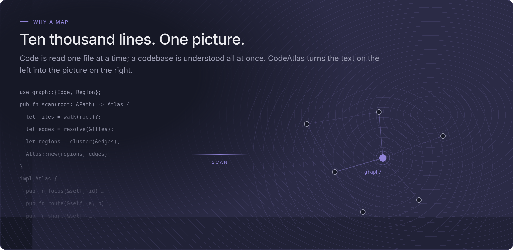
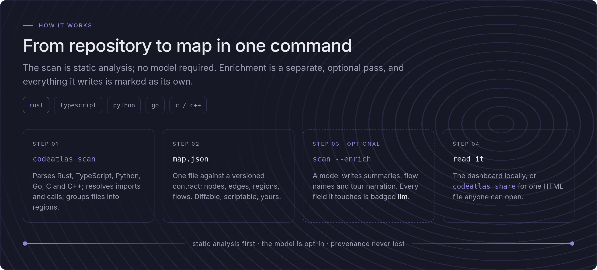
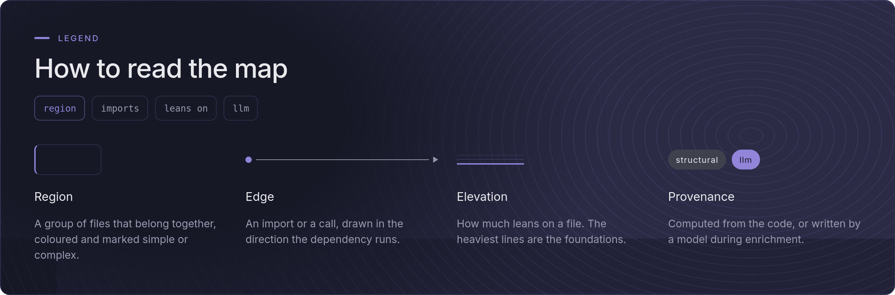
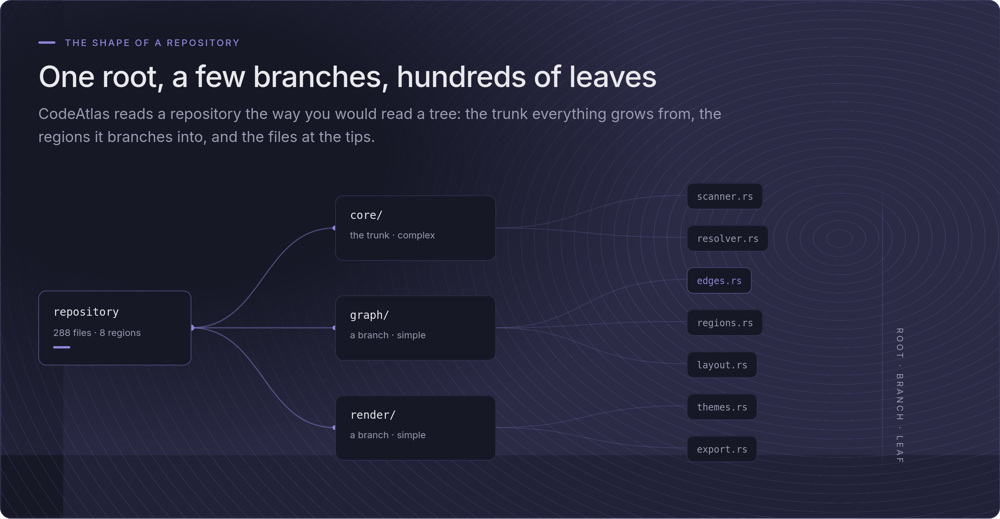
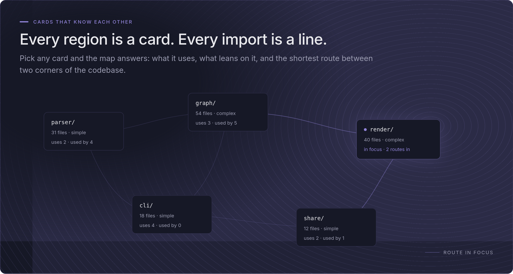
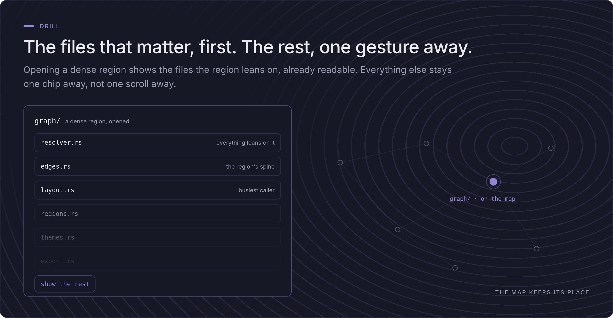
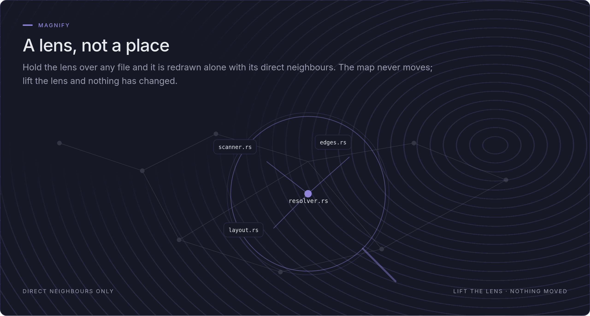
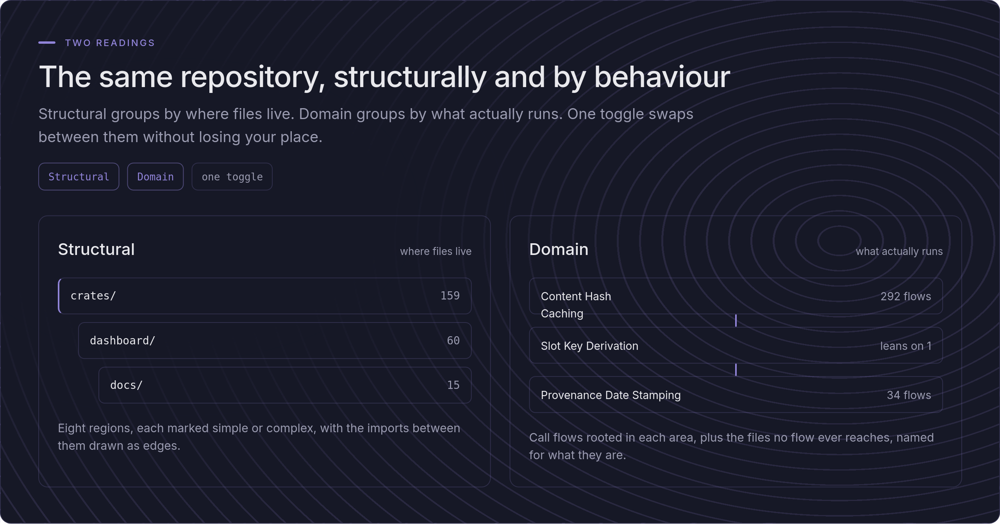
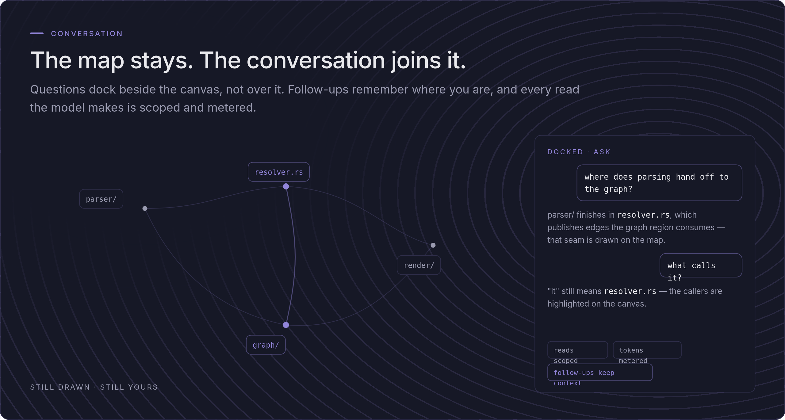
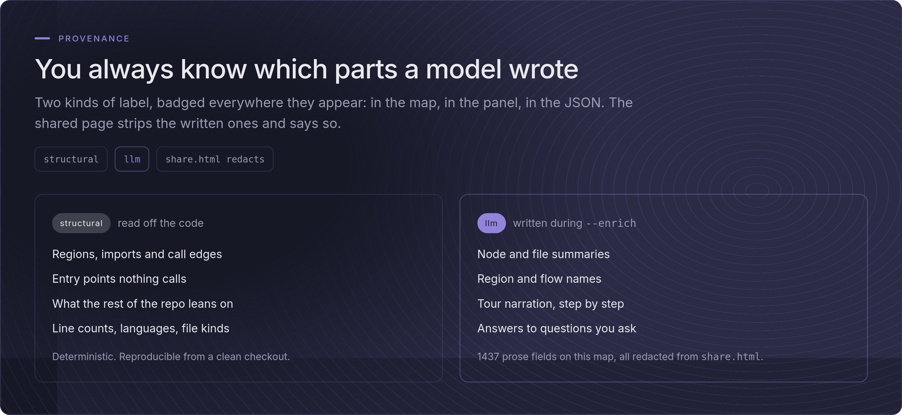

# The tour — what CodeAtlas draws, and how

Back to the [README](../README.md) · [Commands](commands.md) ·
[Enrichment](enrichment.md) · [Security](SECURITY.md) ·
[Development](development.md)

## How it works

<picture>
  <source media="(prefers-color-scheme: dark)" srcset="images/viz-dark.png">
  <source media="(prefers-color-scheme: light)" srcset="images/viz-light.png">
  
</picture>

<picture>
  <source media="(prefers-color-scheme: dark)" srcset="images/pipeline-dark.png">
  <source media="(prefers-color-scheme: light)" srcset="images/pipeline-light.png">
  
</picture>

Parsing uses tree-sitter grammars compiled into the binary; nothing is
downloaded at runtime. Files in unsupported languages still appear as nodes,
so the map stays complete, and every parser resolves imports and calls
conservatively. An edge that cannot be resolved to a node inside the map is
dropped rather than emitted dangling.

The emitted map conforms to a published, versioned contract
(`contract/map.schema.json`, currently **0.5.0**) generated from the Rust
types, which works as the single source of truth. The dashboard's TypeScript types are
generated from the same schema, CI is meant to fail on any drift, and consumers other
than the bundled dashboard can rely on it; `contract/README.md` states the
compatibility policy. Node descriptions carry a `provenance` field of
`structural` or `llm`, so a reader can always tell a mechanically derived
fact from a generated one.

## What it looks like

The cards are minimal but exhaustive, and the main feature they carry is
their connections to other cards, plus what they open in the sidebar once
clicked. Some of these images are real screenshots: the numbers in them were
true the day they were captured, not necessarily today. The rest are
illustrations drawn from a small example repository, not from CodeAtlas
itself.

### How to read the map

<picture>
  <source media="(prefers-color-scheme: dark)" srcset="images/legend-dark.png">
  <source media="(prefers-color-scheme: light)" srcset="images/legend-light.png">
  
</picture>

### One root, a few branches, hundreds of leaves

<picture>
  <source media="(prefers-color-scheme: dark)" srcset="images/tree-dark.png">
  <source media="(prefers-color-scheme: light)" srcset="images/tree-light.png">
  
</picture>

### Every region is a card, every import is a line

<picture>
  <source media="(prefers-color-scheme: dark)" srcset="images/constellation-dark.png">
  <source media="(prefers-color-scheme: light)" srcset="images/constellation-light.png">
  
</picture>

### The files that matter, first

<picture>
  <source media="(prefers-color-scheme: dark)" srcset="images/drill-dark.png">
  <source media="(prefers-color-scheme: light)" srcset="images/drill-light.png">
  
</picture>

### A lens, not a place

<picture>
  <source media="(prefers-color-scheme: dark)" srcset="images/magnify-dark.png">
  <source media="(prefers-color-scheme: light)" srcset="images/magnify-light.png">
  
</picture>

### The same repository, structurally and by behaviour

<picture>
  <source media="(prefers-color-scheme: dark)" srcset="images/twoviews-dark.png">
  <source media="(prefers-color-scheme: light)" srcset="images/twoviews-light.png">
  
</picture>

### The map stays, the conversation joins it

<picture>
  <source media="(prefers-color-scheme: dark)" srcset="images/conversation-dark.png">
  <source media="(prefers-color-scheme: light)" srcset="images/conversation-light.png">
  
</picture>

### You always know which parts a model wrote

<picture>
  <source media="(prefers-color-scheme: dark)" srcset="images/provenance-dark.png">
  <source media="(prefers-color-scheme: light)" srcset="images/provenance-light.png">
  
</picture>

## Languages

| Language   | Extensions                                                   |
| ---------- | ------------------------------------------------------------ |
| TypeScript | `.ts`, `.tsx`                                                |
| JavaScript | `.js`, `.jsx`, `.mjs`, `.cjs`                                |
| Rust       | `.rs`                                                        |
| Python     | `.py`                                                        |
| Go         | `.go`                                                        |
| C          | `.c`, `.h`                                                   |
| C++        | `.cpp`, `.cc`, `.cxx`, `.hpp`, `.hh`, `.hxx`                 |
| Markdown   | `.md`, `.markdown` — relative links become edges; no symbols |

Open code highlights every language above except Markdown, plus CSS,
which the scanner does not parse but the dashboard still shows in colour.
Anything else opens as plain text, and the source panel says so.
